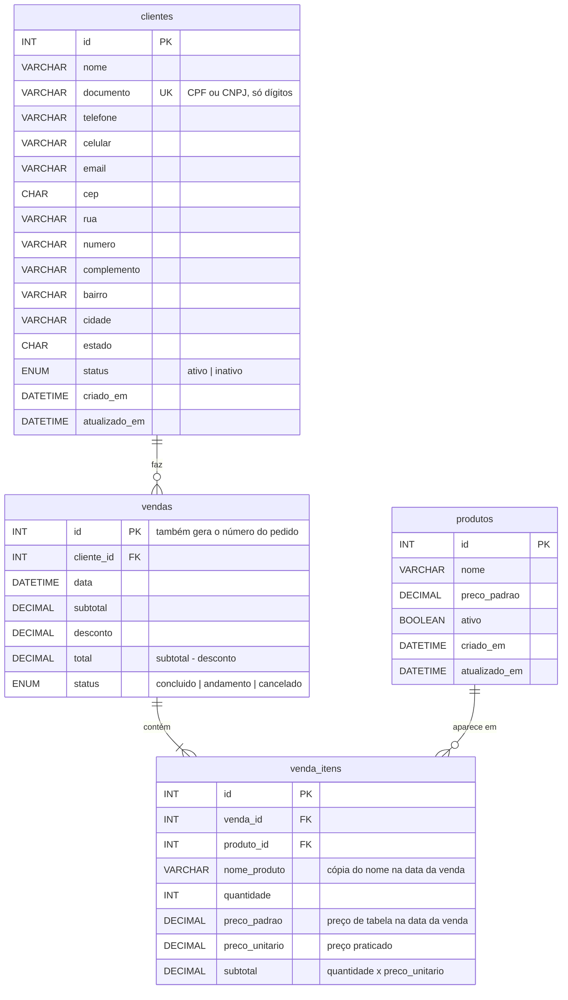
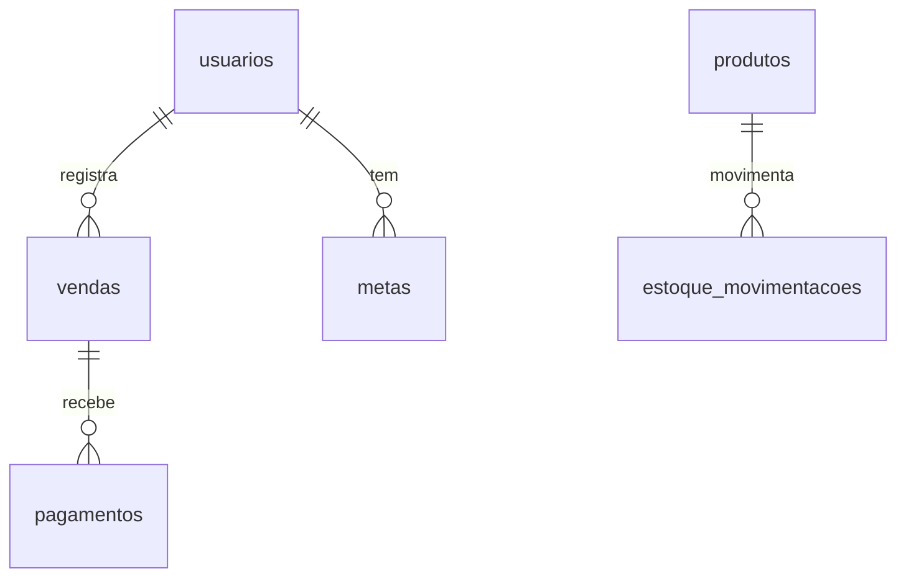

# Banco de dados (MySQL) e integração com o back-end

Este guia mostra **quais tabelas criar no MySQL** para o Sistema MGK e **como o back-end deve responder** para o front-end funcionar sem nenhuma alteração nas telas.

## Sumário

1. [Como as peças se encaixam](#1-como-as-peças-se-encaixam)
2. [Ligando o front-end ao back-end](#2-ligando-o-front-end-ao-back-end)
3. [Diagrama das tabelas](#3-diagrama-das-tabelas)
4. [As tabelas, campo a campo](#4-as-tabelas-campo-a-campo)
5. [Script SQL completo](#5-script-sql-completo)
6. [Dados iniciais (produtos)](#6-dados-iniciais-produtos)
7. [Contrato da API](#7-contrato-da-api)
8. [Regras que o back-end precisa garantir](#8-regras-que-o-back-end-precisa-garantir)
9. [Tabelas para as próximas etapas](#9-tabelas-para-as-próximas-etapas)
10. [Checklist de integração](#10-checklist-de-integração)

---

## 1. Como as peças se encaixam

```text
┌──────────────────────┐   HTTP + JSON   ┌──────────────────────┐    SQL    ┌─────────┐
│ Front-end (este repo)│ ──────────────▶ │ Back-end (API)       │ ────────▶ │  MySQL  │
│ HTML + JS + Bootstrap│ ◀────────────── │ Node, PHP, Java, ... │ ◀──────── │         │
└──────────────────────┘                 └──────────────────────┘           └─────────┘
```

- **O navegador nunca fala direto com o MySQL.** Para isso, o usuário e a senha do banco teriam que ficar no JavaScript, e qualquer pessoa conseguiria ler pelo F12. Por isso existe o back-end no meio: ele guarda as credenciais, valida os dados e executa o SQL.
- O front-end só conhece **URLs** (`GET /api/clientes`, `POST /api/vendas`...) e **JSON**. A linguagem do back-end tanto faz, desde que ele siga o [contrato da seção 7](#7-contrato-da-api).

### O que já foi preparado no front-end

| Arquivo | Papel |
| --- | --- |
| `js/config.js` | Escolhe o modo (`"local"` ou `"api"`) e a URL da API. **É o único arquivo que muda para ligar o back-end.** |
| `js/app.js` → `MGK.api` | Cliente HTTP: envia/recebe JSON, aplica timeout e transforma erros em mensagens para o usuário. |
| `js/app.js` → `MGK.clientes`, `MGK.produtos`, `MGK.vendas` | Repositórios com **duas implementações de mesma interface**: `...Local` (localStorage) e `...Api` (HTTP). As telas não sabem qual está em uso. |
| Telas (`clientes.js`, `cadastro-cliente.js`, `venda.js`) | Já usam `await` em todas as leituras/gravações e tratam falhas de conexão com uma mensagem na tela. |

---

## 2. Ligando o front-end ao back-end

Com a API no ar, edite `js/config.js`:

```js
window.MGK_CONFIG = {
  modo: "api",                            // era "local"
  apiUrl: "http://localhost:3000/api",    // endereço da sua API (sem barra no final)
  timeoutMs: 10000,                       // tempo máximo de espera por resposta
};
```

No modo `"api"`:

- os dados de `mock-data.js` e o `localStorage` deixam de ser usados (dá para remover o `<script src="js/mock-data.js">` dos HTML);
- o botão **"Restaurar dados de demonstração"** some, porque agora os dados são reais.

> **CORS:** se o front-end estiver em um endereço (ex.: Live Server em `http://127.0.0.1:5500`) e a API em outro (`http://localhost:3000`), a API precisa liberar a origem do front-end com o cabeçalho `Access-Control-Allow-Origin`. Sem isso, o navegador bloqueia as requisições e a tela mostra "Não foi possível conectar ao servidor".

---

## 3. Diagrama das tabelas



**Por que 4 tabelas?**

- Um **cliente** tem várias **vendas** (1:N) → `vendas.cliente_id`.
- Uma **venda** tem vários produtos, e o mesmo **produto** aparece em várias vendas (N:N). Relação N:N sempre vira uma tabela no meio: `venda_itens`.
- `venda_itens` guarda uma **cópia** do nome e do preço padrão do produto. Se amanhã o Shampoo passar de R$ 50 para R$ 60, as vendas antigas continuam mostrando R$ 50. É a mesma regra que o front-end já segue (`precoPadrao` × `precoUnitario`).

---

## 4. As tabelas, campo a campo

Convenção: o **MySQL usa `snake_case`** (`criado_em`) e o **JSON da API usa `camelCase`** (`criadoEm`), que é o que o JavaScript espera. A conversão é feita no back-end. As tabelas abaixo mostram as duas formas lado a lado.

### 4.1 `clientes`

| Coluna (MySQL) | Campo (JSON) | Tipo | Obrigatório | Observação |
| --- | --- | --- | :-: | --- |
| `id` | `id` | `INT UNSIGNED AUTO_INCREMENT` | ✔ | Gerado pelo banco |
| `nome` | `nome` | `VARCHAR(120)` | ✔ | Mínimo 3 caracteres |
| `documento` | `documento` | `VARCHAR(14)` | ✔ | **Só dígitos**. 11 = CPF, 14 = CNPJ. **Único** |
| `telefone` | `telefone` | `VARCHAR(11)` | | Só dígitos (10 ou 11) |
| `celular` | `celular` | `VARCHAR(11)` | | Só dígitos (10 ou 11) |
| `email` | `email` | `VARCHAR(120)` | | |
| `cep` | `cep` | `CHAR(8)` | ✔ | Só dígitos |
| `rua` | `rua` | `VARCHAR(120)` | ✔ | |
| `numero` | `numero` | `VARCHAR(10)` | ✔ | Texto, porque existe "S/N", "12A"... |
| `complemento` | `complemento` | `VARCHAR(60)` | | |
| `bairro` | `bairro` | `VARCHAR(80)` | ✔ | |
| `cidade` | `cidade` | `VARCHAR(80)` | ✔ | |
| `estado` | `estado` | `CHAR(2)` | ✔ | UF: `SP`, `RJ`... |
| `status` | `status` | `ENUM('ativo','inativo')` | ✔ | Padrão `ativo` |
| `criado_em` | `criadoEm` | `DATETIME` | ✔ | Preenchido pelo banco |
| `atualizado_em` | `atualizadoEm` | `DATETIME` | | Atualizado pelo banco a cada `UPDATE` |

> O tamanho das colunas é igual ao `maxlength` dos campos do formulário em `cadastro-cliente.html`.
> Os campos opcionais chegam como texto vazio (`""`). O back-end pode gravar `NULL` no lugar.

### 4.2 `produtos`

| Coluna | Campo (JSON) | Tipo | Observação |
| --- | --- | --- | --- |
| `id` | `id` | `INT UNSIGNED AUTO_INCREMENT` | |
| `nome` | `nome` | `VARCHAR(120)` | |
| `preco_padrao` | `precoPadrao` | `DECIMAL(10,2)` | Preço de tabela. **Nunca use `FLOAT` para dinheiro.** |
| `ativo` | *(não enviado)* | `BOOLEAN` | Produto fora de linha fica `0`: some da tela de venda, mas continua no histórico |
| `criado_em` / `atualizado_em` | *(opcional)* | `DATETIME` | |

> Ainda não existe tela de cadastro de produtos. Por enquanto, eles são inseridos via SQL (seção 6).

### 4.3 `vendas`

| Coluna | Campo (JSON) | Tipo | Observação |
| --- | --- | --- | --- |
| `id` | `id` | `INT UNSIGNED AUTO_INCREMENT` | |
| *(calculado)* | `numero` | — | Número do pedido com 6 dígitos: `LPAD(id, 6, '0')` → `"000123"` |
| `cliente_id` | `clienteId` | `INT UNSIGNED` → `clientes.id` | |
| `data` | `data` | `DATETIME` | Momento do registro (gerado pelo servidor) |
| `subtotal` | `subtotal` | `DECIMAL(10,2)` | Soma dos itens |
| `desconto` | `desconto` | `DECIMAL(10,2)` | Entre 0 e o subtotal |
| `total` | `total` | `DECIMAL(10,2)` **gerado** | `subtotal - desconto`, calculado pelo próprio MySQL |
| `status` | `status` | `ENUM('concluido','andamento','cancelado')` | Vendas canceladas não entram no resumo do cliente |
| — | `produtos` | *(array)* | Itens da venda, vindos de `venda_itens` (ver abaixo) |

### 4.4 `venda_itens`

| Coluna | Campo em `venda.produtos[]` | Tipo | Observação |
| --- | --- | --- | --- |
| `id` | *(não enviado)* | `INT UNSIGNED AUTO_INCREMENT` | |
| `venda_id` | *(não enviado)* | `INT UNSIGNED` → `vendas.id` | Apagar a venda apaga os itens (`ON DELETE CASCADE`) |
| `produto_id` | `produtoId` | `INT UNSIGNED` → `produtos.id` | |
| `nome_produto` | `nome` | `VARCHAR(120)` | Cópia do nome na data da venda |
| `quantidade` | `quantidade` | `SMALLINT UNSIGNED` | 1 a 999 |
| `preco_padrao` | `precoPadrao` | `DECIMAL(10,2)` | Cópia do preço de tabela na data da venda |
| `preco_unitario` | `precoUnitario` | `DECIMAL(10,2)` | Preço **praticado** (pode ser diferente do padrão) |
| `subtotal` | `subtotal` | `DECIMAL(10,2)` **gerado** | `quantidade * preco_unitario` |

---

## 5. Script SQL completo

Requer **MySQL 8.0.16 ou superior** (por causa das regras `CHECK`). Pode ser executado no MySQL Workbench, no phpMyAdmin ou pela linha de comando (`mysql -u root -p < schema.sql`).

```sql
-- ============================================================================
-- Sistema MGK — estrutura do banco
-- ============================================================================
CREATE DATABASE IF NOT EXISTS mgk
  DEFAULT CHARACTER SET utf8mb4
  DEFAULT COLLATE utf8mb4_0900_ai_ci;   -- "ai_ci": busca ignora acentos e maiúsculas

USE mgk;

-- ----------------------------------------------------------------------------
-- Clientes
-- ----------------------------------------------------------------------------
CREATE TABLE clientes (
  id            INT UNSIGNED  NOT NULL AUTO_INCREMENT,
  nome          VARCHAR(120)  NOT NULL,
  documento     VARCHAR(14)   NOT NULL,
  telefone      VARCHAR(11)   NULL,
  celular       VARCHAR(11)   NULL,
  email         VARCHAR(120)  NULL,
  cep           CHAR(8)       NOT NULL,
  rua           VARCHAR(120)  NOT NULL,
  numero        VARCHAR(10)   NOT NULL,
  complemento   VARCHAR(60)   NULL,
  bairro        VARCHAR(80)   NOT NULL,
  cidade        VARCHAR(80)   NOT NULL,
  estado        CHAR(2)       NOT NULL,
  status        ENUM('ativo','inativo') NOT NULL DEFAULT 'ativo',
  criado_em     DATETIME      NOT NULL DEFAULT CURRENT_TIMESTAMP,
  atualizado_em DATETIME      NULL     DEFAULT NULL ON UPDATE CURRENT_TIMESTAMP,

  PRIMARY KEY (id),
  UNIQUE KEY uk_clientes_documento (documento),
  KEY idx_clientes_nome (nome),
  CONSTRAINT ck_clientes_documento CHECK (documento REGEXP '^([0-9]{11}|[0-9]{14})$'),
  CONSTRAINT ck_clientes_cep       CHECK (cep REGEXP '^[0-9]{8}$')
) ENGINE=InnoDB;

-- ----------------------------------------------------------------------------
-- Produtos
-- ----------------------------------------------------------------------------
CREATE TABLE produtos (
  id            INT UNSIGNED  NOT NULL AUTO_INCREMENT,
  nome          VARCHAR(120)  NOT NULL,
  preco_padrao  DECIMAL(10,2) NOT NULL,
  ativo         BOOLEAN       NOT NULL DEFAULT TRUE,
  criado_em     DATETIME      NOT NULL DEFAULT CURRENT_TIMESTAMP,
  atualizado_em DATETIME      NULL     DEFAULT NULL ON UPDATE CURRENT_TIMESTAMP,

  PRIMARY KEY (id),
  UNIQUE KEY uk_produtos_nome (nome),
  CONSTRAINT ck_produtos_preco CHECK (preco_padrao > 0)
) ENGINE=InnoDB;

-- ----------------------------------------------------------------------------
-- Vendas (cabeçalho)
-- ----------------------------------------------------------------------------
CREATE TABLE vendas (
  id          INT UNSIGNED  NOT NULL AUTO_INCREMENT,
  cliente_id  INT UNSIGNED  NOT NULL,
  data        DATETIME      NOT NULL DEFAULT CURRENT_TIMESTAMP,
  subtotal    DECIMAL(10,2) NOT NULL,
  desconto    DECIMAL(10,2) NOT NULL DEFAULT 0,
  total       DECIMAL(10,2) AS (subtotal - desconto) STORED,
  status      ENUM('concluido','andamento','cancelado') NOT NULL DEFAULT 'concluido',

  PRIMARY KEY (id),
  KEY idx_vendas_cliente_data (cliente_id, data),
  KEY idx_vendas_data (data),
  CONSTRAINT fk_vendas_cliente FOREIGN KEY (cliente_id) REFERENCES clientes (id)
    ON UPDATE CASCADE ON DELETE RESTRICT,           -- não deixa apagar cliente com vendas
  CONSTRAINT ck_vendas_valores CHECK (subtotal >= 0 AND desconto >= 0 AND desconto <= subtotal)
) ENGINE=InnoDB;

-- ----------------------------------------------------------------------------
-- Itens da venda
-- ----------------------------------------------------------------------------
CREATE TABLE venda_itens (
  id              INT UNSIGNED      NOT NULL AUTO_INCREMENT,
  venda_id        INT UNSIGNED      NOT NULL,
  produto_id      INT UNSIGNED      NOT NULL,
  nome_produto    VARCHAR(120)      NOT NULL,
  quantidade      SMALLINT UNSIGNED NOT NULL,
  preco_padrao    DECIMAL(10,2)     NOT NULL,
  preco_unitario  DECIMAL(10,2)     NOT NULL,
  subtotal        DECIMAL(10,2)     AS (quantidade * preco_unitario) STORED,

  PRIMARY KEY (id),
  KEY idx_itens_venda (venda_id),
  KEY idx_itens_produto (produto_id),
  CONSTRAINT fk_itens_venda   FOREIGN KEY (venda_id)   REFERENCES vendas (id)   ON DELETE CASCADE,
  CONSTRAINT fk_itens_produto FOREIGN KEY (produto_id) REFERENCES produtos (id) ON DELETE RESTRICT,
  CONSTRAINT ck_itens_quantidade CHECK (quantidade BETWEEN 1 AND 999),
  CONSTRAINT ck_itens_preco      CHECK (preco_unitario > 0)
) ENGINE=InnoDB;
```

### Usuário do banco para a API

Não use o `root` na aplicação. Crie um usuário só com as permissões de que a API precisa:

```sql
CREATE USER 'mgk_app'@'localhost' IDENTIFIED BY 'troque-esta-senha';
GRANT SELECT, INSERT, UPDATE, DELETE ON mgk.* TO 'mgk_app'@'localhost';
```

A senha fica em um arquivo `.env` do back-end, **fora do Git**, e nunca no front-end.

---

## 6. Dados iniciais (produtos)

Como ainda não há tela de produtos, cadastre o catálogo direto no banco. Estes são os mesmos produtos da demonstração:

```sql
INSERT INTO produtos (nome, preco_padrao) VALUES
  ('Shampoo Profissional',  50.00),
  ('Máscara Capilar',       80.00),
  ('Kit Profissional',     150.00),
  ('Condicionador',         45.00),
  ('Leave-in',              40.00),
  ('Óleo Reparador',        65.00),
  ('Kit Progressiva',      220.00),
  ('Kit Hidratação',       120.00);
```

Para testar, cadastre alguns clientes pela própria tela **Cadastrar Cliente**.

---

## 7. Contrato da API

Todas as rotas ficam abaixo de `apiUrl` (ex.: `http://localhost:3000/api`). Requisições e respostas usam `Content-Type: application/json`.

### 7.1 Resumo das rotas

| Método | Rota | Usada em | Resposta de sucesso |
| --- | --- | --- | --- |
| `GET` | `/clientes` | Lista de clientes | `200` → `Cliente[]` ordenado por nome |
| `GET` | `/clientes?busca=<termo>` | Busca na lista e na tela de venda | `200` → `Cliente[]` |
| `GET` | `/clientes?documento=<só dígitos>` | Aviso de CPF/CNPJ já cadastrado | `200` → `Cliente[]` (vazio ou 1 item) |
| `GET` | `/clientes/:id` | Ficha, edição, venda | `200` → `Cliente` · `404` se não existir |
| `POST` | `/clientes` | Cadastrar cliente | `201` → `Cliente` criado |
| `PUT` | `/clientes/:id` | Editar cliente | `200` → `Cliente` atualizado |
| `GET` | `/produtos` | Tela de venda | `200` → `Produto[]` ativos, por nome |
| `GET` | `/produtos/:id` | — | `200` → `Produto` · `404` |
| `GET` | `/vendas` | — | `200` → `Venda[]` da mais recente para a mais antiga |
| `GET` | `/vendas?clienteId=<id>` | Histórico e resumo da ficha | `200` → `Venda[]` do cliente, mais recente primeiro |
| `GET` | `/vendas/:id` | Detalhes da venda | `200` → `Venda` · `404` |
| `POST` | `/vendas` | Finalizar venda | `201` → `Venda` completa |

### 7.2 Formato dos objetos

**Cliente**

```json
{
  "id": 1,
  "nome": "Ana Fictícia Moreira",
  "documento": "12345678062",
  "telefone": "1130000001",
  "celular": "11900000001",
  "email": "ana.ficticia@exemplo.com",
  "cep": "01000000",
  "rua": "Rua Exemplo",
  "numero": "100",
  "complemento": "Sala 1",
  "bairro": "Centro",
  "cidade": "São Paulo",
  "estado": "SP",
  "status": "ativo",
  "criadoEm": "2026-01-12T10:00:00.000Z",
  "atualizadoEm": null
}
```

**Produto**

```json
{ "id": 1, "nome": "Shampoo Profissional", "precoPadrao": 50.00 }
```

**Venda** (sempre com os itens em `produtos`, inclusive na listagem, porque o histórico mostra os produtos de cada pedido)

```json
{
  "id": 123,
  "numero": "000123",
  "clienteId": 1,
  "data": "2026-09-15T15:00:00.000Z",
  "produtos": [
    { "produtoId": 1, "nome": "Shampoo Profissional", "quantidade": 2,
      "precoPadrao": 50.00, "precoUnitario": 45.00, "subtotal": 90.00 }
  ],
  "subtotal": 90.00,
  "desconto": 10.00,
  "total": 80.00,
  "status": "concluido"
}
```

### 7.3 O que o front-end envia

**`POST /clientes`** e **`PUT /clientes/:id`**: sem `id`, `criadoEm` e `atualizadoEm`, porque quem define esses campos é o servidor. Documento, telefones e CEP vão **só com dígitos**.

```json
{
  "nome": "Ana Fictícia Moreira", "documento": "12345678062",
  "telefone": "", "celular": "11900000001", "email": "ana@exemplo.com",
  "cep": "01000000", "rua": "Rua Exemplo", "numero": "100", "complemento": "",
  "bairro": "Centro", "cidade": "São Paulo", "estado": "SP",
  "status": "ativo"
}
```

**`POST /vendas`**: só o essencial. **Nome, preço padrão, subtotais, total, número e data são definidos pelo servidor.**

```json
{
  "clienteId": 1,
  "itens": [
    { "produtoId": 1, "quantidade": 2, "precoUnitario": 45.00 },
    { "produtoId": 5, "quantidade": 1, "precoUnitario": 40.00 }
  ],
  "desconto": 10.00
}
```

### 7.4 Erros

Em qualquer erro, responda com o status HTTP adequado e um JSON com a mensagem **que será mostrada ao usuário** (em português):

```json
{ "erro": "Já existe um cliente cadastrado com este CPF." }
```

| Status | Quando | Como o front-end reage |
| --- | --- | --- |
| `400` | Dados inválidos (CPF inválido, quantidade 0, desconto maior que o subtotal...) | Mostra `erro` num aviso vermelho |
| `404` | Registro não existe | `obter()` devolve `null` → tela mostra "não encontrado" |
| `409` | CPF/CNPJ já cadastrado em outro cliente | Marca o campo documento como inválido + aviso |
| `500` | Erro inesperado | Mostra `erro` ou "Erro 500 no servidor." |
| *(sem resposta)* | API fora do ar ou lenta | "Não foi possível conectar ao servidor..." |

---

## 8. Regras que o back-end precisa garantir

O front-end valida tudo antes de enviar, mas **qualquer pessoa pode chamar a API direto** (pelo F12, Postman...). Por isso, o back-end sempre valida de novo.

### Clientes

- Validar CPF/CNPJ (dígitos verificadores), campos obrigatórios e tamanhos. A regra de CPF/CNPJ está em `MGK.validate` no `app.js` e pode ser portada.
- Documento repetido → `409`. O `UNIQUE KEY` do banco garante isso mesmo com dois cadastros simultâneos: capture o erro `ER_DUP_ENTRY` (código 1062) e devolva 409.
- **Busca (`?busca=`)** deve se comportar como no modo local:
  - se o termo tiver só números, pontos, traços, barras e espaços, e pelo menos 3 dígitos → buscar **por documento**: remover a pontuação e usar `documento LIKE CONCAT('%', ?, '%')`;
  - senão → buscar **por nome**: `nome LIKE CONCAT('%', ?, '%')`. Com a collation `utf8mb4_0900_ai_ci`, "joao" encontra "João" sem nenhum código extra.

### Vendas (`POST /vendas`)

Faça tudo dentro de **uma transação** (`START TRANSACTION` … `COMMIT`). Se qualquer passo falhar, `ROLLBACK`, e nada fica pela metade:

1. Conferir se o cliente existe (senão, `404`).
2. Conferir se `itens` não está vazio e se cada item tem `quantidade` inteira entre 1 e 999 e `precoUnitario > 0` (senão, `400`).
3. Buscar cada produto **no banco** (não confie em nome e preço vindos do front-end). Produto inexistente ou inativo → `400`.
4. Calcular subtotal = Σ(quantidade × precoUnitario), com arredondamento em centavos, e conferir `0 ≤ desconto ≤ subtotal`.
5. `INSERT INTO vendas (cliente_id, subtotal, desconto) ...` e pegar o `id` gerado.
6. `INSERT INTO venda_itens (...)` para cada item, copiando `nome` e `preco_padrao` do produto.
7. `COMMIT` e devolver a venda completa (mesmo formato do `GET /vendas/:id`), com status `201`.

### Formato dos dados na resposta

- **Dinheiro como número**, não texto: `50.00` e não `"50.00"`. No Node com `mysql2`, use a opção `decimalNumbers: true` na conexão. Sem isso, os `DECIMAL` chegam como texto e as somas do front-end viram concatenação.
- **Datas em ISO 8601 UTC** (`"2026-09-15T15:00:00.000Z"`). No `mysql2`, use `timezone: "Z"`. Um `Date` do JavaScript já vira esse formato no `JSON.stringify`.
- **`numero` da venda** com 6 dígitos: `LPAD(v.id, 6, '0') AS numero`.
- **Nomes dos campos em camelCase** (`clienteId`, `precoUnitario`, `criadoEm`...). No SQL dá para usar apelidos: `SELECT preco_padrao AS precoPadrao ...`.
- Os `id` podem ser números: o front-end compara ids com `MGK.mesmoId`, que funciona com número ou texto.

### Consultas de exemplo

```sql
-- Vendas de um cliente com os itens (GET /vendas?clienteId=1)
SELECT v.id, LPAD(v.id, 6, '0') AS numero, v.cliente_id AS clienteId, v.data,
       v.subtotal, v.desconto, v.total, v.status
  FROM vendas v
 WHERE v.cliente_id = ?
 ORDER BY v.data DESC, v.id DESC;

SELECT i.venda_id, i.produto_id AS produtoId, i.nome_produto AS nome, i.quantidade,
       i.preco_padrao AS precoPadrao, i.preco_unitario AS precoUnitario, i.subtotal
  FROM venda_itens i
 WHERE i.venda_id IN (?)          -- ids das vendas acima; agrupe os itens por venda_id no código
 ORDER BY i.id;

-- Resumo do cliente (o front-end calcula sozinho, mas serve para relatórios)
SELECT COUNT(*) AS quantidade, COALESCE(SUM(total), 0) AS totalGasto, MAX(data) AS ultimaCompra
  FROM vendas
 WHERE cliente_id = ? AND status <> 'cancelado';
```

---

## 9. Tabelas para as próximas etapas

O menu já mostra **Vendedores, Estoque, Pagamentos e Metas** como "Em breve". Abaixo, uma sugestão de estrutura para cada um, **para quando essas telas forem construídas**. Não é preciso criar agora: elas encaixam nas tabelas atuais sem mudar nada do que já existe.



### 9.1 `usuarios` (login e vendedores)

Um vendedor é um usuário com perfil `vendedor`. Assim, a mesma tabela serve para o login e para a tela de Vendedores.

```sql
CREATE TABLE usuarios (
  id          INT UNSIGNED NOT NULL AUTO_INCREMENT,
  nome        VARCHAR(120) NOT NULL,
  email       VARCHAR(120) NOT NULL,
  senha_hash  VARCHAR(255) NOT NULL,           -- bcrypt/argon2, NUNCA a senha em texto
  perfil      ENUM('admin','vendedor') NOT NULL DEFAULT 'vendedor',
  ativo       BOOLEAN NOT NULL DEFAULT TRUE,
  criado_em   DATETIME NOT NULL DEFAULT CURRENT_TIMESTAMP,
  PRIMARY KEY (id),
  UNIQUE KEY uk_usuarios_email (email)
) ENGINE=InnoDB;

-- Quem fez cada venda (NULL para as vendas antigas)
ALTER TABLE vendas
  ADD COLUMN vendedor_id INT UNSIGNED NULL AFTER cliente_id,
  ADD CONSTRAINT fk_vendas_vendedor FOREIGN KEY (vendedor_id) REFERENCES usuarios (id);
```

### 9.2 `estoque_movimentacoes` (Estoque)

Em vez de só um campo "quantidade", cada entrada e saída vira um registro. Assim dá para saber **por que** o estoque mudou.

```sql
ALTER TABLE produtos ADD COLUMN estoque_atual INT NOT NULL DEFAULT 0;

CREATE TABLE estoque_movimentacoes (
  id          INT UNSIGNED NOT NULL AUTO_INCREMENT,
  produto_id  INT UNSIGNED NOT NULL,
  tipo        ENUM('entrada','saida','ajuste') NOT NULL,
  quantidade  INT NOT NULL,                    -- positivo entra, negativo sai
  venda_id    INT UNSIGNED NULL,               -- preenchido quando a saída veio de uma venda
  usuario_id  INT UNSIGNED NULL,
  observacao  VARCHAR(255) NULL,
  criado_em   DATETIME NOT NULL DEFAULT CURRENT_TIMESTAMP,
  PRIMARY KEY (id),
  KEY idx_mov_produto (produto_id, criado_em),
  CONSTRAINT fk_mov_produto FOREIGN KEY (produto_id) REFERENCES produtos (id),
  CONSTRAINT fk_mov_venda   FOREIGN KEY (venda_id)   REFERENCES vendas (id),
  CONSTRAINT fk_mov_usuario FOREIGN KEY (usuario_id) REFERENCES usuarios (id)
) ENGINE=InnoDB;
```

No `POST /vendas`, dentro da mesma transação, grave uma movimentação de `saida` por item e subtraia de `produtos.estoque_atual`.

### 9.3 `pagamentos` (Pagamentos)

Uma venda pode ser paga em partes (ex.: metade no Pix, metade no cartão).

```sql
CREATE TABLE pagamentos (
  id          INT UNSIGNED NOT NULL AUTO_INCREMENT,
  venda_id    INT UNSIGNED NOT NULL,
  forma       ENUM('dinheiro','pix','debito','credito','boleto') NOT NULL,
  valor       DECIMAL(10,2) NOT NULL,
  parcelas    TINYINT UNSIGNED NOT NULL DEFAULT 1,
  status      ENUM('pendente','pago','estornado') NOT NULL DEFAULT 'pendente',
  vencimento  DATE NULL,
  pago_em     DATETIME NULL,
  PRIMARY KEY (id),
  KEY idx_pag_venda (venda_id),
  KEY idx_pag_status_venc (status, vencimento),
  CONSTRAINT fk_pag_venda FOREIGN KEY (venda_id) REFERENCES vendas (id) ON DELETE CASCADE,
  CONSTRAINT ck_pag_valor CHECK (valor > 0)
) ENGINE=InnoDB;
```

### 9.4 `metas` (Metas)

Meta mensal por vendedor ou da loja inteira (`usuario_id` nulo).

```sql
CREATE TABLE metas (
  id          INT UNSIGNED NOT NULL AUTO_INCREMENT,
  usuario_id  INT UNSIGNED NULL,               -- NULL = meta da loja
  mes         DATE NOT NULL,                   -- sempre o dia 1: '2026-09-01'
  valor_meta  DECIMAL(12,2) NOT NULL,
  PRIMARY KEY (id),
  UNIQUE KEY uk_metas_usuario_mes (usuario_id, mes),
  CONSTRAINT fk_metas_usuario FOREIGN KEY (usuario_id) REFERENCES usuarios (id)
) ENGINE=InnoDB;

-- Realizado x meta de um vendedor no mês
SELECT m.valor_meta, COALESCE(SUM(v.total), 0) AS realizado
  FROM metas m
  LEFT JOIN vendas v ON v.vendedor_id = m.usuario_id
                    AND v.status <> 'cancelado'
                    AND v.data >= m.mes AND v.data < m.mes + INTERVAL 1 MONTH
 WHERE m.usuario_id = ? AND m.mes = '2026-09-01'
 GROUP BY m.id;
```

---

## 10. Checklist de integração

- [ ] Rodar o script da [seção 5](#5-script-sql-completo) e os produtos da [seção 6](#6-dados-iniciais-produtos)
- [ ] Criar o usuário `mgk_app` e colocar as credenciais no `.env` do back-end
- [ ] Implementar as rotas da [seção 7](#7-contrato-da-api), com respostas em camelCase, dinheiro como número e datas em ISO
- [ ] Liberar CORS para o endereço do front-end
- [ ] Testar as rotas (Postman/Insomnia) antes de ligar o front-end
- [ ] Trocar `modo` para `"api"` em `js/config.js`
- [ ] Testar no navegador: cadastrar cliente, editar, CPF repetido (deve avisar), registrar venda, abrir a ficha e os detalhes da venda
- [ ] Desligar a API e conferir se as telas mostram "Não foi possível conectar ao servidor" em vez de travar
